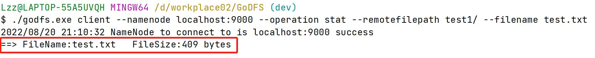

# GoDFS

<!-- PROJECT SHIELDS -->


[![MIT License][license-shield]][license-url]


<!-- PROJECT LOGO -->
<br />

<p align="center">
  <a href="https://github.com/liuzongzhou/GoDFS.git">
    
  </a>

<h3 align="center">简易分布式存储系统</h3>
  <p align="center">
    <br />
    <a href="https://github.com/liuzongzhou/GoDFS.git"><strong>探索本项目的文档 »</strong></a>
    <br />
    <br />
  </p>
  </p>

**Attention:** We always welcome contributors to the project. Before adding your contribution, please carefully read our [Git 分支管理规范](https://ypbg9olvt2.feishu.cn/docs/doccnTMRmh7YgMwL2PgZ5moWUsd)和[注释规范](https://juejin.cn/post/7096881555246678046)。

## 目录
- [荣誉展示](#荣誉展示)
- [上手指南](#上手指南)
    - [开发前的配置要求](#开发前的配置要求)
    - [安装步骤](#安装步骤)
    - [演示界面](#演示界面)
    - [演示视频](#演示视频)
    - [命令行使用手册](#命令行使用手册)
- [文件目录说明](#文件目录说明)
- [开发的整体设计](#开发的整体设计)
    - [整体的架构图](#整体的架构图)
    - [Client架构的设计](#Client架构的设计)
    - [NameNode架构的设计](#NameNode架构的设计)
    - [DataNode架构的设计](#DataNode架构的设计)
    - [服务模块的设计](#服务模块的设计)
        - [基础功能模块的设计](#基础功能模块的设计)
        - [进阶功能模块的设计](#进阶功能模块的设计)
        - [客户端功能模块的设计](#客户端功能模块的设计)
- [性能测试](#性能测试)
- [使用到的技术](#使用到的技术)
- [未来展望](#未来展望)
    - [元数据Raft实现](#元数据Raft实现)
    - [存储节点扩容](#存储节点扩容)
    - [基于纠删码EC算法的存储策略](#基于纠删码EC算法的存储策略)
- [如何参与开源项目](#如何参与开源项目)
- [版本控制](#版本控制)
- [贡献者](#贡献者)
- [鸣谢](#鸣谢)

### 荣誉展示
<a href="https://github.com/liuzongzhou/GoDFS.git">
    
    
</a>

### 上手指南

#### 开发前的配置要求

1. go 1.18.1
2. 导入 github.com/google/uuid v1.3.0
3. 建议运行在多台服务器上，项目开发资源有限，演示在本地不同端口


#### 安装步骤
1. 下载源码
```sh
git clone https://github.com/liuzongzhou/GoDFS.git
```
2. 编译main.go文件
```sh
go build -o godfs.exe main.go
```
3. 打开多个Terminal
#### 演示界面
**基础功能演示**

<a href="https://github.com/liuzongzhou/GoDFS.git">
    
    
    
    
    
    
    
    
    
    
    
</a>

**拓展功能演示**

<a href="https://github.com/liuzongzhou/GoDFS.git">
    
    
    
    
</a>


#### 演示视频
[](https://www.bilibili.com/video/BV1ia41197d3/?vd_source=c2c09eea4ea7693f88030c5023abb455)

#### 命令行使用手册
注：所有命令均可直接点击左侧绿色箭头直接运行
- **DataNode daemon**
  Syntax:
- data-location为该DataNode节点分配的根目录
  ```bash
  ./godfs datanode [--port] <portNumber> --data-location <dataLocation>
  ```
  Sample command:
- 指定端口号7002，当端口号被占用自动查找空闲端口，返回最终使用端口号
- 不指定端口号,默认从7000开始，自动查找空闲端口，返回最终使用端口号
  ```bash
  ./godfs.exe datanode --port 7002 --data-location D:/workplace1/dndata3/
  ```
  
- **NameNode daemon**
  Syntax:
  ```bash
  ./godfs namenode [--port] <portNumber> [--datanodes] <dnEndpoints> --block-size <blockSize> --replication-factor <replicationFactor> [--primary-port] <primaryPort> 
  ```
  Sample command:
- 指定port号9000,当端口号被占用自动查找空闲端口，返回最终使用端口号
- 不指定端口号,默认从9000开始，自动查找空闲端口，返回最终使用端口号
- 指定dataNode list,仅添加这些DataNode节点
- 不指定dataNode list,进行网络发现，添加所有可用的DataNode节点
- 指定primary port,将该端口号的NameNode设置为主NameNode
- 不指定primary port,默认将该端口号为9000的NameNode设置为主NameNode
  ```bash
  ./godfs.exe namenode --port 9000 --datanodes localhost:7000,localhost:7001,localhost:7002 --block-size 10 --replication-factor 2 --primary-port 9000
  ```

- **Client**
  - **Mkdir** operation
    Syntax:
    - remotefilepath是相对路径，不要添加根目录
    ```bash
    ./godfs client --namenode <host:priamryPort> --operation mkdir --remotefilepath <remotefilepath>
    ```
    Sample command:
    ```bash
    ./godfs.exe client --namenode localhost:9000 --operation mkdir --remotefilepath test1/
    ```
    
  - **Put** operation
    Syntax:
    - remotefilepath是相对路径，不要添加根目录
    ```bash
    ./godfs client --namenode <host:priamryPort> --operation put --source-path <locationToFile> --filename <fileName> --remotefilepath <remotefilepath>
    ```
    Sample command:
    ```bash
    ./godfs.exe client --namenode localhost:9000 --operation put --source-path D:/workplace1/ --filename test.txt --remotefilepath test1/
    ```
    
  - **Get** operation
    Syntax:
    - remotefilepath是相对路径，不要添加根目录
    - localfilepath是下载到本地的路径，需要绝对路径
    ```bash
    ./godfs client --namenode <host:priamryPort> --operation get --remotefilepath <remotefilepath> --filename <fileName> --localfilepath <localfilepath>
    ```
    Sample command:
    ```bash
    ./godfs.exe client --namenode localhost:9000 --operation get --remotefilepath test1/ --filename test.txt --localfilepath D:/workplace1/test.txt
    ```
    
  - **Stat** operation
      Syntax:
    - remotefilepath是相对路径，不要添加根目录
    ```bash
    ./godfs client --namenode <host:priamryPort> --operation stat --remotefilepath <remotefilepath> --filename <fileName> 
    ```
    Sample command:
    ```bash
    ./godfs.exe client --namenode localhost:9000 --operation stat --remotefilepath test1/ --filename test.txt
    ```
    
  - **List** operation
    Syntax:
    - remote_dir_path 远端存储目标路径，也是相对路径不要加根目录
    ```bash
    ./godfs client --namenode <host:priamryPort> --operation list --remote_dir_path <remote_dir_path> 
    ```
    Sample command:
    ```bash
    ./godfs.exe client --namenode localhost:9000 --operation list --remote_dir_path test1/
    ```
    
  - **Rename** operation
    Syntax:
    - rename_src_name是相对路径：远端原路径或者远端原路径+文件名
    - rename_dest_name是相对路径：远端重命名路径或者远端原路径+重命名文件
    ```bash
    ./godfs client --namenode <host:priamryPort> --operation rename --rename_src_name <rename_src_name> --rename_dest_name <rename_dest_name>
    ```
    Sample command:
  
    1.修改文件名
    ```bash
    ./godfs.exe client --namenode localhost:9000 --operation rename --rename_src_name test1/test.txt --rename_dest_name test1/test1.txt
    ```
    2.修改文件目录
    ```bash
    ./godfs.exe client --namenode localhost:9000 --operation rename --rename_src_name test1/ --rename_dest_name test2/
    ```
    
  - **Deletefile** operation
    Syntax:
    - remotefilepath是相对路径：远端目录路径
    - filename 文件名
    ```bash
    ./godfs client --namenode <host:priamryPort> --operation deletefile --remotefilepath <remotefilepath> --filename <filename>
    ```
    Sample command:
    ```bash
    ./godfs.exe client --namenode localhost:9000 --operation deletefile --remotefilepath test1/ --filename test.txt
    ```

  - **Deletepath** operation
    Syntax:
    - remotefilepath是相对路径：远端目录路径
    - filename 文件名
    ```bash
    ./godfs client --namenode <host:priamryPort> --operation deletepath --remotefilepath <rename_src_name>
    ```
    Sample command:
    ```bash
    ./godfs.exe client --namenode localhost:9000 --operation deletepath --remotefilepath test1/
    ```

### 文件目录说明

```
GoDFS
|-- client 客户端
|-- daemon 进程
|   |-- client 客户端进程
|   |-- datanode dataNode节点进程
|   |-- namenode nameNode节点进程
|-- datanode dataNode服务及方法
|-- namenode nameNode服务及方法
|-- images 图片引用
|-- util 工具
|-- .gitignore 
|-- go.mod
|-- godfs.exe 编译文件
|-- LICENSE
|-- main.go
|-- README.md·
```

### 开发的整体设计
#### 整体的架构图
<p align="center">
  <a href="https://github.com/liuzongzhou/GoDFS.git">
    
  </a>

#### Client架构的设计
<p align="center">
  <a href="https://github.com/liuzongzhou/GoDFS.git">
    
  </a>
</p>

#### NameNode架构的设计
<p align="center">
  <a href="https://github.com/liuzongzhou/GoDFS.git">
    
  </a>
</p>

#### DataNode架构的设计
<p align="center">
  <a href="https://github.com/liuzongzhou/GoDFS.git">
    
  </a>
</p>

#### 服务模块的设计

###### 基础功能模块的设计
基础功能模块包括：
- 初始化DataNode节点
- 初始化NameNode节点
- Put（分布式存储+备份+负载均衡）
- Get、Delete(path or filename)、Stat、List、Rename(path or filename)。

详情请阅读[基础功能模块设计说明](https://ypbg9olvt2.feishu.cn/docs/doccnYOxhX0tWiGN2VzM0L2Leff) 查阅为该模块的详细设计。

###### 进阶功能模块的设计
进阶功能模块包括：
- NameNode发现并添加网络中存活的DataNode
- NameNodes高可用且元数据一致性
- 心跳检测DataNode节点。
- DataNode故障时数据迁移+负载均衡

详情请阅读[进阶功能模块设计说明](https://ypbg9olvt2.feishu.cn/docx/doxcnIlelv8tKsb2Ukfk36L3SKr) 查阅为该模块的详细设计。

###### 客户端功能模块的设计
客户端功能模块包含命令行解析功能。

详情请阅读[客户端功能模块设计说明](https://ypbg9olvt2.feishu.cn/docx/doxcnG73wTscowKolPuV6PERkJg) 查阅为该模块的详细设计。


### 性能测试
通过命令 go tool pprof -http=:8000 "http://localhost:8080/debug/pprof/profile?seconds=10" 生成的火焰图

#### Put：
<p align="center">
<a href="https://github.com/liuzongzhou/GoDFS.git">
    
</a>

#### Get:
<p align="center">
<a href="https://github.com/liuzongzhou/GoDFS.git">
    
</a>

仅展示部分接口，更多接口详细参数分析请阅读[性能测试](https://ypbg9olvt2.feishu.cn/docx/doxcncPKu0MQbtWia9Cxmte0cuc)文档。

### 使用到的技术
RPC相关：
- [net/rpc](https://blog.csdn.net/qq_49723651/article/details/121765269)
性能测试：
- [pprof](https://zhuanlan.zhihu.com/p/396363069)
### 未来展望
#### 元数据Raft实现
元数据一致性共识模块：Raft协议实现(etcd)
<p align="center">
  <a href="https://github.com/liuzongzhou/GoDFS.git">
    
  </a>
</p>

#### 存储节点扩容
1. 在NameNode节点初始化的时候开启协程，此协程开启定时任务执行网络发现，rpc连接+应答指定消息表示确认为可用DataNode空闲节点
2. 更新NameNode的元数据信息，将此DataNode节点的元数据信息写入相关集合
3. 统计之前DataNodes节点上的Block总数,平均后得出若数据迁移，需要迁移的Block数，遍历之前的DataNodes节点，挨个迁移到新的DataNode节点
4. 同时目前新的写入Block任务，优先写入到新的DataNode节点，直到新的DataNode节点上Block数达到需要迁移的Block数值，在开始正常分布式写入
5. 返回完成存储节点的扩容的状态

#### 基于纠删码EC算法的存储策略
<p align="center">
  <a href="https://github.com/liuzongzhou/GoDFS.git">
    
  </a>
</p>

### 如何参与开源项目

贡献使开源社区成为一个学习、激励和创造的绝佳场所。你所作的任何贡献都是**非常感谢**的。

1. Fork the Project
2. Create your Feature Branch (`git checkout -b feature/AmazingFeature`)
3. Commit your Changes (`git commit -m 'Add some AmazingFeature'`)
4. Push to the Branch (`git push origin feature/AmazingFeature`)
5. Open a Pull Request

### 版本控制

该项目使用Git进行版本管理。您可以在repository参看当前可用版本。

### 贡献者
- 刘宗舟 邮箱:1245314855@qq.com
- 华浩宇 邮箱:862548552@qq.com

*您也可以查阅仓库为该项目做出贡献的开发者。*

### 版权说明

该项目签署了MIT 授权许可，详情请参阅 [LICENSE.txt](https://github.com/shaojintian/Best_README_template/blob/master/LICENSE.txt)

### 鸣谢

- [字节跳动大数据青训营](https://youthcamp.bytedance.com/)

<!-- links -->

[license-shield]: https://img.shields.io/github/license/mrxuexi/tiktok.svg?style=flat-square

[license-url]: https://github.com/mrxuexi/tiktok/blob/master/LICENSE.txt